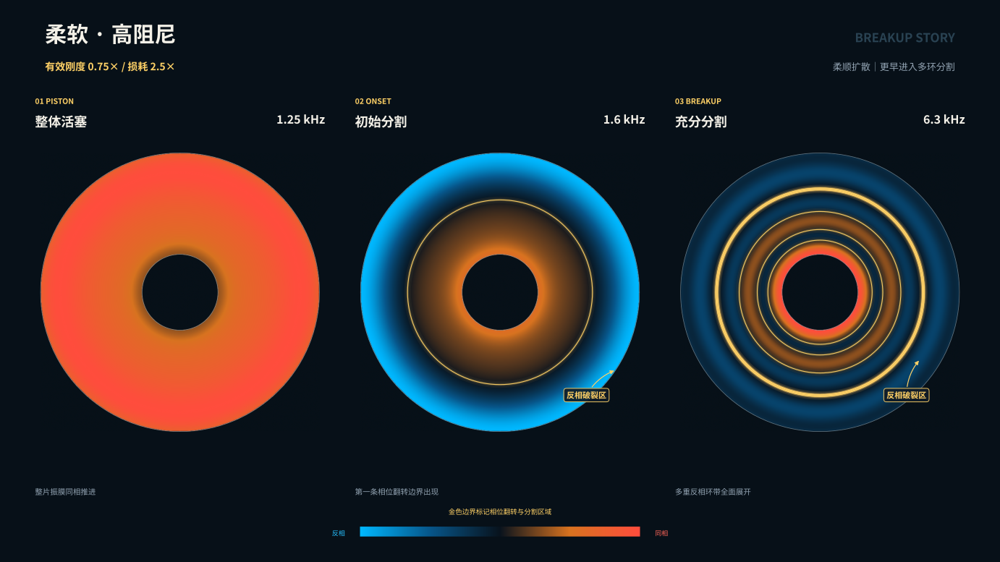
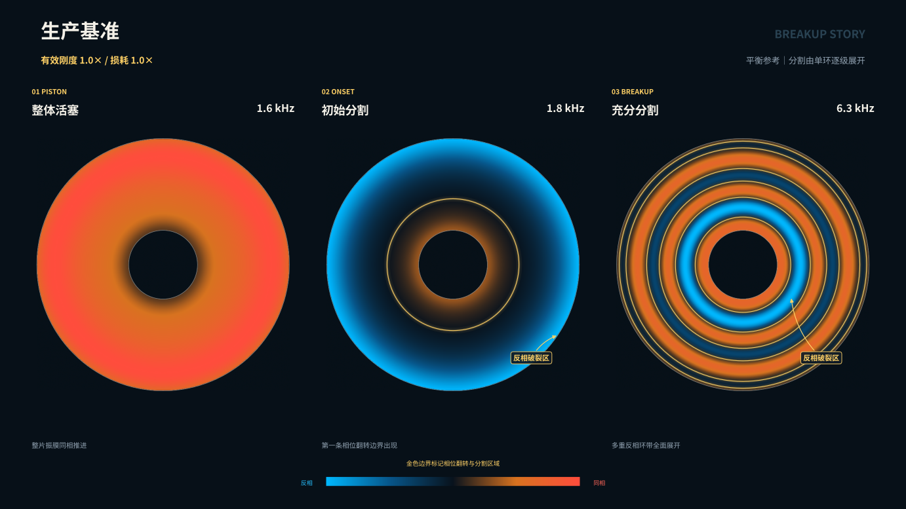
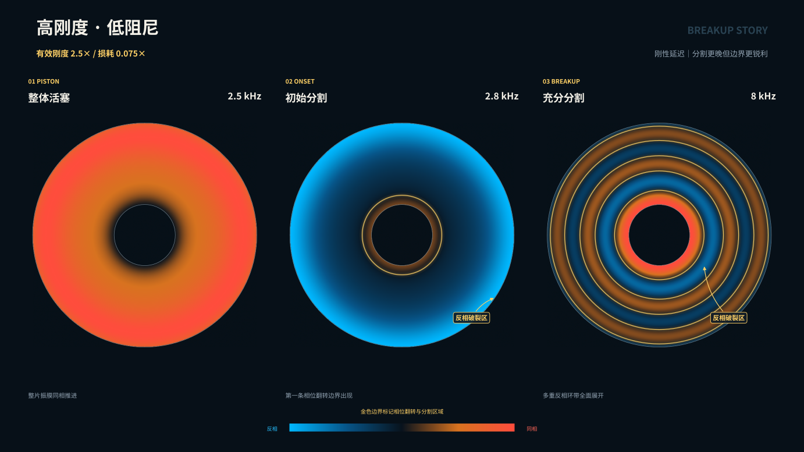

# 振膜参数与分割振动可视化记录

本目录只记录振膜分割振动的视觉结果，不混入阻抗、效率或频响量化曲线。

## 视觉阅读方式

- 红橙色：与音圈参考相位同向；
- 蓝青色：与音圈参考相位反向；
- 金色发光环：轴向位移穿零的相位翻转边界，也是分割区域边界；
- 每套参数分为“整体活塞、初始分割、充分分割”三个独立阶段；
- 每幅场图先对齐音圈相位，再按本图峰值归一化，因此颜色用于比较形态，不用于比较绝对幅值。

## 参数与自动选取的阶段

| 参数组 | 整体活塞 | 初始分割 | 充分分割 |
|---|---:|---:|---:|
| 柔软、高阻尼：有效刚度 0.75×，损耗 2.5× | 1.25 kHz | 1.6 kHz | 6.3 kHz |
| 生产基准：有效刚度 1.0×，损耗 1.0× | 1.6 kHz | 1.8 kHz | 6.3 kHz |
| 高刚度、低阻尼：有效刚度 2.5×，损耗 0.075× | 2.5 kHz | 2.8 kHz | 8 kHz |

初始分割定义为离散扫频中首次出现显著径向相位穿零的频点；充分分割选取后续径向分割边界最多的频点。以上是当前离散频率表上的判断，不表示连续频率上的精确临界值。

## 三套宽屏海报

### 柔软、高阻尼



### 生产基准



### 高刚度、低阻尼



九张独立阶段大图位于 [`stage_panels/`](stage_panels/)，可脱离海报单独引用。

## 分割程度对近场与远场的影响

以下九张 16:9 独立大图把同一频点的三层信息并排对应：左侧是振膜源面的同相/反相区域，中间是 FEM 近场声压干涉，右侧是由求解结果计算的远场辐射形态。它们不是把多个频点挤进一张总览，而是每个参数、每个阶段各占一张完整画布。

### 柔软、高阻尼

- [整体活塞 · 1.25 kHz](acoustic_impact/soft_damped/soft_damped_piston_1250Hz_acoustic_impact.png)
- [初始分割 · 1.6 kHz](acoustic_impact/soft_damped/soft_damped_onset_1600Hz_acoustic_impact.png)
- [充分分割 · 6.3 kHz](acoustic_impact/soft_damped/soft_damped_developed_6300Hz_acoustic_impact.png)

### 生产基准

- [整体活塞 · 1.6 kHz](acoustic_impact/baseline/baseline_piston_1600Hz_acoustic_impact.png)
- [初始分割 · 1.8 kHz](acoustic_impact/baseline/baseline_onset_1800Hz_acoustic_impact.png)
- [充分分割 · 6.3 kHz](acoustic_impact/baseline/baseline_developed_6300Hz_acoustic_impact.png)

### 高刚度、低阻尼

- [整体活塞 · 2.5 kHz](acoustic_impact/stiff_ringing/stiff_ringing_piston_2500Hz_acoustic_impact.png)
- [初始分割 · 2.8 kHz](acoustic_impact/stiff_ringing/stiff_ringing_onset_2800Hz_acoustic_impact.png)
- [充分分割 · 8 kHz](acoustic_impact/stiff_ringing/stiff_ringing_developed_8000Hz_acoustic_impact.png)

视觉上，整体活塞阶段对应连续、平滑的近场波前和单一宽主瓣；初始分割在源面出现第一条反相环，近场随之形成首批抵消区；充分分割时多个同相/反相环成为多个耦合声源区，近场热点与零压区显著增多，远场则重组为窄主瓣、旁瓣和深零点。这里展示的是形态变化，不以归一化图形推断绝对声压或辐射效率。

## 文件组织

- `poster_soft_damped.*`：柔软高阻尼参数的三阶段宽屏海报；
- `poster_baseline.*`：生产基准三阶段宽屏海报；
- `poster_stiff_ringing.*`：高刚度低阻尼参数的三阶段宽屏海报；
- `stage_panels/`：九张可单独引用的阶段大图；
- `acoustic_impact/`：九张“振膜源面—近场干涉—远场辐射”独立大图及输入清单；
- `visualization_manifest.json`：阶段频率、输入场文件与生成信息；
- `configs/`：本次可视化专用参数覆盖，不改变生产配置。

## 计算合同

- 轴对称 P2 结构–声学耦合 FEM；
- 1 A peak 谐波电流驱动；
- 相同几何、密度、声学负载和折环参数；
- 只改变锥盆有效刚度与损耗倍率；
- 扫频点：0.5–8 kHz 共 20 点；
- 参数倍率在本诊断配置中全频生效，生产配置仍保持原 2.5–4.5 kHz 过渡合同。

由于模型是轴对称的，本图只表示同心径向分割环，不能表示周向瓣状、摇摆或偏心破裂模态。

## 复现

先用两套诊断配置和生产基准分别执行 `--single-profile --save-each` 扫频，再运行：

```bash
python tools/plot_breakup_story_posters.py \
  --root runs/diaphragm_breakup_comparison_20260901/full_sweep \
  --outdir visualizations/diaphragm_breakup_parameter_study_20260901

python tools/plot_breakup_acoustic_impact.py \
  --root runs/diaphragm_breakup_comparison_20260901/full_sweep \
  --outdir visualizations/diaphragm_breakup_parameter_study_20260901/acoustic_impact
```

结构海报只读取 `solid_*Hz.vtu`；声场故事同时读取 `acoustic_*Hz.vtu` 与 `directivity_*Hz.csv`。两个脚本都不会修改求解结果。
